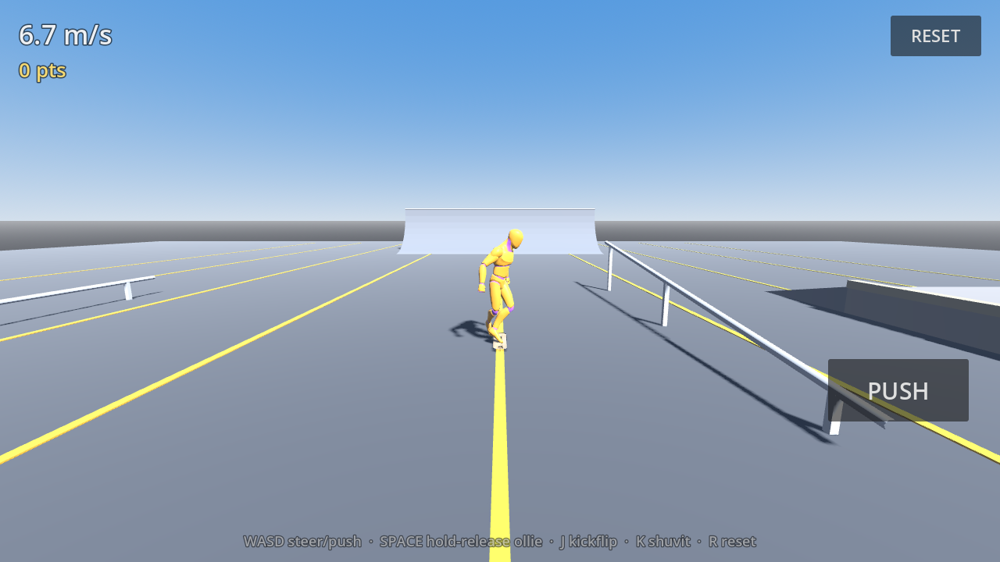

# Skate

A small third-person skateboarding prototype for Android, built in **Godot 4.3** with GDScript.

The goal here is feel, not scope: the skating physics, the controls, the animation blending and
the camera are the product. The park is deliberately small and the art is deliberately plain.



## Playing it

| | Touch (Android) | Keyboard (desktop) |
|---|---|---|
| Steer | Drag anywhere on the **left half** — the stick appears under your thumb | `A` / `D` |
| Brake / powerslide | Drag the left stick **down** | `S` |
| Push | **PUSH** button, tap repeatedly | `W` |
| Ollie | Hold anywhere on the **right half** to load, release to pop | Hold/release `Space` |
| Kickflip | Load the pop pad, **flick left** as you release | `J` |
| 360 shuvit | Load the pop pad, **flick right** as you release | `K` |
| Grind | Ollie onto a rail, ledge or coping roughly in line with it | — |
| Reset | **RESET** button | `R` |

Steering is speed-dependent: you get a slow kick-turn when stopped, the sharpest carve at
walking-to-jogging pace, and progressively less bite the faster you go. Carving hard scrubs speed,
so the fastest line through the park is the smoothest one.

The ollie is charged: a tap gives you a small hop, a full hold gives you enough air to land a
kickflip. Land before the board has come back round and you eat it.

## Running it

```bash
# desktop, with the editor or the plain binary
godot --path . 

# headless behaviour tests -- physics, tricks, grinds, respawn, animation wiring
godot --headless --path . res://tests/SmokeTest.tscn

# reference screenshots (needs a GL context; xvfb is fine)
xvfb-run -a godot --path . --rendering-driver opengl3 \
  --resolution 1280x720 res://tests/Screenshots.tscn
```

`SmokeTest.tscn` boots the real `Main.tscn` and drives it through the same input struct the touch
HUD writes to, so it exercises the actual game rather than a mock. It exits non-zero on failure and
is what CI runs.

## Building the Android APK

The project targets the **GL Compatibility** renderer and `arm64-v8a` / `armeabi-v7a`, which covers
essentially every current Android device.

1. Install the Godot 4.3 **export templates** (in the editor: *Editor → Manage Export Templates*, or
   drop `Godot_v4.3-stable_export_templates.tpz` into `~/.local/share/godot/export_templates/4.3.stable/`).
2. Install a JDK 17 and the Android SDK (build-tools + platform-tools), and point Godot at them in
   *Editor Settings → Export → Android*.
3. Create a debug keystore if you do not have one:
   ```bash
   keytool -keyalg RSA -genkeypair -alias androiddebugkey -keypass android \
     -keystore ~/.android/debug.keystore -storepass android \
     -dname "CN=Android Debug,O=Android,C=US" -validity 9999 -deststoretype pkcs12
   ```
4. Export:
   ```bash
   mkdir -p build
   godot --headless --path . --export-debug "Android" build/skate.apk
   ```
5. Install: `adb install -r build/skate.apk`

`.github/workflows/android.yml` does all of the above on a runner and uploads the APK as a build
artifact, so a green CI run is proof the project still builds for Android.

## How it works

### Skating physics — `scripts/skater/SkaterController.gd`

The skater is a `CharacterBody3D` whose velocity is integrated by hand, so the four forces that
decide how skating feels stay separately tunable: tangential gravity, rolling resistance, lateral
grip and steering. Two decisions are load-bearing:

- **`MOTION_MODE_FLOATING`, not grounded.** Godot's grounded motion mode discards the velocity
  along the up axis every tick. That is right for walking and catastrophic for skating: on a steep
  transition it throws away nearly all of the skater's speed, so they crawl down a quarter pipe
  instead of dropping in. Ground contact instead comes from five downward wheel probes (centre plus
  the four truck positions), averaged into one surface normal, which also stops the board popping
  between facets where a ramp meets flat ground.
- **The normal force redirects, it does not decelerate.** Naively dropping the velocity component
  into the surface bleeds speed on every curved surface, because a transition's normal rotates a
  little each tick and the truncation eats the difference. While the skater is genuinely riding
  along a surface the direction is constrained but the speed carries through; arriving at a steep
  angle is a real impact and there the normal component is simply dropped.

The collider is a sphere at wheel height rather than an upright capsule — a standing capsule wedges
into steep transitions because its top ends up inside the ramp.

### Tricks — `scripts/skater/TrickSystem.gd`

The board model spins independently of the board pivot: the pivot tracks heading and the surface,
the model adds the flip on top. A trick is "caught" only once its rotation has come back round to
level, so landing early is a bail — that is what gives the tricks weight. Chained tricks in one air
build a combo multiplier, scored on landing.

### Grinds — `scripts/skater/GrindSystem.gd`, `scripts/park/Rail.gd`

Rails and ledges are `Curve3D`s. When the skater comes down onto one roughly in line with it, they
snap to the curve and are driven along it directly rather than by `move_and_slide`, which is what
keeps a 50-50 from chattering off the bar. Gravity still pulls you along a sloped rail. Popping off
carries your speed along the tangent.

### Animation — `scripts/skater/SkaterAnimator.gd`, `SkateLeanModifier.gd`

The Quaternius library has no skateboarding clips, so the approach is two-layer: a state machine
picks the closest generic clip as a base pose, and a `SkeletonModifier3D` layers the skating on top
— stance width along the deck, crouch depth driven by speed and the ollie charge, carve lean that
tracks the steering input, shoulder counter-rotation and balance arms. It multiplies into the
animated pose rather than replacing it, so the underlying clip still breathes through.

There is no leg IK, so bending the knees would lift the feet off the deck; the animator sinks the
whole character by however far the feet rose, which keeps them planted at any crouch depth and for
any clip.

### Park — `scripts/park/ParkBuilder.gd`

The park is generated from code: flat ground, two facing quarter pipes with grindable coping, a
bank, a funbox with ledges and kickers, a flat rail and a down-rail. Keeping it procedural means no
binary level data in the repo and collision that matches the visuals exactly, which matters when
the whole game is about riding the surface you can see.

One trap worth knowing: **Godot treats clockwise-wound triangles as front-facing**, the opposite of
the right-hand rule. Get it backwards and rays — and the skater — fall straight through the ramp
while colliding with its underside.

### Camera — `scripts/camera/FollowCamera.gd`

Follows position closely but eases *yaw* toward the direction of travel, so spins and quick carves
read as the skater rotating rather than the world whipping around. Height, distance and FOV open up
with speed and in the air, and a ray from the skater pulls the camera in rather than letting a ramp
come between them.

## Layout

```
assets/board/          skateboard.glb  (converted from the supplied FBX)
assets/character/      UAL1_Standard.glb  (Quaternius Universal Animation Library)
scenes/                Main, Skatepark, player/Skater, ui/TouchHUD
scripts/skater/        controller, tricks, grinds, animation
scripts/park/          procedural park, rails
scripts/camera/        follow camera
scripts/ui/            touch controls + readout
scripts/game/          autoloads: Game (state) and Controls (input)
tests/                 SmokeTest, Screenshots
tools/                 fbx.py, fbx2glb.py -- the FBX -> glTF conversion
```

## Assets

- **Character and animations**: [Universal Animation Library](https://quaternius.com/) by
  Quaternius — CC0 1.0 Universal. `assets/character/LICENSE-UAL.txt`.
- **Skateboard**: supplied with the brief. Godot 4 cannot import `.fbx` without FBX2glTF, so
  `tools/fbx2glb.py` reads the binary FBX directly, bakes the object transform into the vertices and
  normalises the result to a 0.80 m deck with its top surface at the origin, then writes a `.glb`
  with the base-colour texture embedded.

## Known limitations

This is a prototype, and these are the honest edges:

- No leg IK, so the feet straddle the deck rather than locking to it, and they do not track the
  board through a flip.
- Grind balance is automatic — there is no balance meter to fight.
- Tricks are ollie, kickflip and 360 shuvit only; there are no grabs, manuals or reverts.
- The bail is an animation and a respawn, not a ragdoll.
- No audio.
