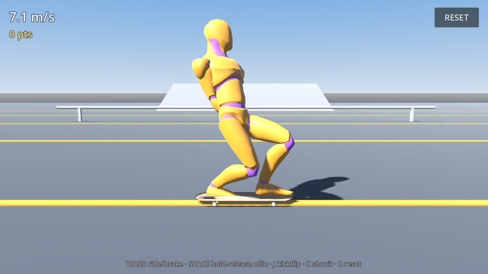

# Skate

A small third-person skateboarding prototype for Android, built in **Godot 4.3** with GDScript.

The goal here is feel, not scope: the skating physics, the controls, the animation blending and
the camera are the product. The park is deliberately small and the art is deliberately plain.



## Playing it

| | Touch (Android) | Keyboard (desktop) |
|---|---|---|
| Ride / steer | **Left half** — a full analog stick appears wherever your thumb lands. Push it where you want to skate | `W` `A` `S` `D` |
| Brake | Pull the stick back against the way you are going | `S` |
| Ollie | **Right half** — hold to load, release to pop | Hold/release `Space` |
| Kickflip | Load the pop pad, **flick left** as you release | `J` |
| 360 shuvit | Load the pop pad, **flick right** as you release | `K` |
| Grind | Ollie onto a rail, ledge or coping roughly in line with it | — |
| Reset | **RESET** button | `R` |

The stick names a direction *on screen*, not a rudder position. Push it where you want to go and
the skater carves that way; because it is resolved in camera space it keeps meaning the same thing
however the view has swung round. Pushing forward drives the pushes, holding it back past side-on
is the brake, and at a standstill it becomes a kick-turn so you can point yourself anywhere before
setting off. There is no separate push button — one thumb rides, the other pops.

Steering has weight: the trucks take up a steering input over about a quarter of a second rather
than snapping to it, and they let go faster than they load, so the board leans into a carve and
straightens promptly. Authority tails off with speed and carving hard scrubs speed, so the fastest
line through the park is the smoothest one.

The ollie is charged: a tap gives you a small hop, a full hold gives you enough air to land a
kickflip. Land before the board has come back round and you eat it.

## Running it

```bash
# desktop, with the editor or the plain binary
godot --path . 

# headless behaviour tests -- physics, tricks, grinds, respawn, animation wiring
godot --headless --path . res://tests/SmokeTest.tscn

# reference screenshots (needs a GL context; xvfb is fine)
xvfb-run -a godot --path . --rendering-driver opengl3 \
  --resolution 1280x720 res://tests/Screenshots.tscn
```

`SmokeTest.tscn` boots the real `Main.tscn` and drives it through the same input struct the touch
HUD writes to, so it exercises the actual game rather than a mock. It exits non-zero on failure and
is what CI runs.

## Building the Android APK

The project targets the **GL Compatibility** renderer and `arm64-v8a` / `armeabi-v7a`, which covers
essentially every current Android device.

1. Install the Godot 4.3 **export templates** (in the editor: *Editor → Manage Export Templates*, or
   drop `Godot_v4.3-stable_export_templates.tpz` into `~/.local/share/godot/export_templates/4.3.stable/`).
2. Install a JDK 17 and the Android SDK (build-tools + platform-tools), and point Godot at them in
   *Editor Settings → Export → Android*.
3. Create a debug keystore if you do not have one:
   ```bash
   keytool -keyalg RSA -genkeypair -alias androiddebugkey -keypass android \
     -keystore ~/.android/debug.keystore -storepass android \
     -dname "CN=Android Debug,O=Android,C=US" -validity 9999 -deststoretype pkcs12
   ```
4. Export:
   ```bash
   mkdir -p build
   godot --headless --path . --export-debug "Android" build/skate.apk
   ```
5. Install: `adb install -r build/skate.apk`

`.github/workflows/android.yml` does all of the above on a runner and uploads the APK as a build
artifact, so a green CI run is proof the project still builds for Android.

This has been run end to end: the debug export produces a ~74 MB APK
(`org.godotengine.skate`, minSdk 21) that `apksigner verify` accepts under the v1, v2 and v3
schemes, carrying `arm64-v8a`, `armeabi-v7a` and `x86_64` native libraries. Most of that size is
Godot's debug template across three architectures; a release export with the emulator-only
`x86_64` slice turned off is considerably smaller.

## How it works

### Skating physics — `scripts/skater/SkaterController.gd`

The skater is a `CharacterBody3D` whose velocity is integrated by hand, so the four forces that
decide how skating feels stay separately tunable: tangential gravity, rolling resistance, lateral
grip and steering. Two decisions are load-bearing:

- **`MOTION_MODE_FLOATING`, not grounded.** Godot's grounded motion mode discards the velocity
  along the up axis every tick. That is right for walking and catastrophic for skating: on a steep
  transition it throws away nearly all of the skater's speed, so they crawl down a quarter pipe
  instead of dropping in. Ground contact instead comes from five downward wheel probes (centre plus
  the four truck positions), averaged into one surface normal, which also stops the board popping
  between facets where a ramp meets flat ground.
- **The normal force redirects, it does not decelerate.** Naively dropping the velocity component
  into the surface bleeds speed on every curved surface, because a transition's normal rotates a
  little each tick and the truncation eats the difference. While the skater is genuinely riding
  along a surface the direction is constrained but the speed carries through; arriving at a steep
  angle is a real impact and there the normal component is simply dropped.

The collider is a sphere at wheel height rather than an upright capsule — a standing capsule wedges
into steep transitions because its top ends up inside the ramp.

### Tricks — `scripts/skater/TrickSystem.gd`

The board model spins independently of the board pivot: the pivot tracks heading and the surface,
the model adds the flip on top. A trick is "caught" only once its rotation has come back round to
level, so landing early is a bail — that is what gives the tricks weight. Chained tricks in one air
build a combo multiplier, scored on landing.

### Grinds — `scripts/skater/GrindSystem.gd`, `scripts/park/Rail.gd`

Rails and ledges are `Curve3D`s. When the skater comes down onto one roughly in line with it, they
snap to the curve and are driven along it directly rather than by `move_and_slide`, which is what
keeps a 50-50 from chattering off the bar. Gravity still pulls you along a sloped rail. Popping off
carries your speed along the tangent.

### Character/board alignment — the thing that was most wrong

The rig faces **+Z** while Godot's forward is **−Z** — a Blender export artifact. The first build
compensated with an eyeballed yaw on the character node, which lined the board up but meant every
forward-moving animation clip played *across* the deck. That is what "pushing forward makes the
character move sideways" actually was: not an animation choice, a coordinate-system bug.

The fix is that the character's root points along the board's nose (a flat 180°, verified by a test
that compares the two basis vectors), and the sideways skate stance comes from twisting the
**pelvis** inside the skeleton — hips open across the deck, shoulders following about 80% of the
way, head turning back down the line. That is the real anatomy, and it leaves the root aligned with
travel so nothing downstream has to compensate.

### Animation — `scripts/skater/SkaterAnimator.gd`, `SkateLeanModifier.gd`

Reviewing the library honestly: it contains no skateboarding clips, and its locomotion clips
(`Walk`, `Jog_Fwd`, `Sprint`, `Crouch_Fwd`, `Push`) are worse than nothing here, because each one
steps the body through space. `Crouch_Idle` reads well by name but is a folded-over sneak. So the
clips supply only two base states — `Idle` while on the board, and `Roll` for a bail, where a canned
full-body animation is genuinely the right answer — and everything that reads as skating is built
procedurally in a `SkeletonModifier3D` from the board's real state: stance twist, crouch depth
following speed and the ollie charge, carve lean tracking the trucks, landing compression, balance
arms, and the push stroke. Transitions cannot snap, because the procedural layer is continuous by
construction and the only cross-fade left is on and off a bail.

**The feet are solved, not posed.** Each leg is placed by closed-form two-bone IK against a target
on the deck, expressed in the *board's* frame, so the soles sit over the trucks at any crouch depth,
on any slope, through any lean, and as the trucks compress. Targets are clamped to the leg's actual
reach first, so the solver is always given something it can hit exactly. A push is then just that
target leaving the deck, reaching down beside the board, sweeping back along the ground and stepping
back on — which is what a push is, rather than a jog clip played sideways.

Three bugs in this area only became findable once the invariant was asserted directly:

- Godot **restores bone poses after the modifier pass**, so reading `get_bone_global_pose()` from
  outside it returns the pre-modifier values. The first version of the test measured those and
  reported a working solver as 300 mm out. The solved positions are now captured inside the pass.
- The AnimationTree processed *after* the skeleton's modifier pass and wrote the raw clip pose
  straight over the skate pose, which looks like a modifier that half-works rather than an ordering
  bug.
- `SkaterAnimator._ready()` runs before its parent's `@onready` vars exist, so the board reference
  was null and the feet were placed against the skeleton origin instead of the deck — a constant
  12 cm float while every individual pose value still looked reasonable.

`SkateLeanModifier.sole_clearance()` exists for exactly this reason: it reports how far each planted
sole sits off the deck surface, and the tests assert it is under a millimetre. Every alignment bug
above showed up there as a fixed offset.

### Park — `scripts/park/ParkBuilder.gd`### Park — `scripts/park/ParkBuilder.gd`

The park is generated from code: flat ground, two facing quarter pipes with grindable coping, a
bank, a funbox with ledges and kickers, a flat rail and a down-rail. Keeping it procedural means no
binary level data in the repo and collision that matches the visuals exactly, which matters when
the whole game is about riding the surface you can see.

One trap worth knowing: **Godot treats clockwise-wound triangles as front-facing**, the opposite of
the right-hand rule. Get it backwards and rays — and the skater — fall straight through the ramp
while colliding with its underside.

### Camera — `scripts/camera/FollowCamera.gd`

Follows position closely but eases *yaw* toward the board's **heading**. It used to chase the
velocity vector, which disagrees with heading during a carve or a powerslide, so the camera swung
against the turn the player had just asked for. Heading is what the stick controls, so following it
means view and input always agree.

The camera also publishes its yaw to `Controls`, which is what makes camera-space stick input
possible. The loop converges rather than oscillating: the stick asks the heading to turn toward the
view, the view eases toward the heading. Height, distance and FOV open up with speed and in the air,
and a ray from the skater pulls the camera in rather than letting a ramp come between them.

### Touch controls — `scripts/ui/TouchHUD.gd`

Two "touch anywhere" zones rather than fixed widgets, so you never have to find a control. The one
non-obvious fix: Godot's `emulate_mouse_from_touch` / `emulate_touch_from_mouse` are **off** in the
project settings. The emulation mirrors only the first finger, so holding the pop pad with one thumb
stopped the other thumb's stick from tracking. Both event types are handled explicitly instead, and
the HUD re-centres everything on focus loss so a finger lifting outside the window cannot leave the
stick stuck on.

The joystick is covered by tests that feed synthetic `InputEventScreenTouch`/`Drag` through the HUD,
including two simultaneous thumbs — an input-plumbing bug is not something physics tests can find.

## Layout

```
assets/board/          skateboard.glb  (converted from the supplied FBX)
assets/character/      UAL1_Standard.glb  (Quaternius Universal Animation Library)
scenes/                Main, Skatepark, player/Skater, ui/TouchHUD
scripts/skater/        controller, tricks, grinds, animation
scripts/park/          procedural park, rails
scripts/camera/        follow camera
scripts/ui/            touch controls + readout
scripts/game/          autoloads: Game (state) and Controls (input)
tests/                 SmokeTest, Screenshots
tools/                 fbx.py, fbx2glb.py -- the FBX -> glTF conversion
```

## Assets

- **Character and animations**: [Universal Animation Library](https://quaternius.com/) by
  Quaternius — CC0 1.0 Universal. `assets/character/LICENSE-UAL.txt`.
- **Skateboard**: supplied with the brief. Godot 4 cannot import `.fbx` without FBX2glTF, so
  `tools/fbx2glb.py` reads the binary FBX directly, bakes the object transform into the vertices and
  normalises the result to a 0.80 m deck with its top surface at the origin, then writes a `.glb`
  with the base-colour texture embedded.

## Known limitations

This is a prototype, and these are the honest edges:

- The board is one rigid mesh, so the wheels do not spin and the deck does not flex.
- Grind balance is automatic — there is no balance meter to fight.
- Tricks are ollie, kickflip and 360 shuvit only; no grabs, manuals or reverts.
- A bail plays a tumble and respawns; the board stays with the skater rather than skidding away, and
  there is no ragdoll.
- The feet do not track the board through a flip — the character keeps its stance while the deck
  spins underneath.
- Regular/goofy is fixed by the sign of `stance_yaw` in `SkateLeanModifier`, and `front_foot` has to
  agree with it (the hip twist swings one hip toward the nose; putting the other foot there makes
  the legs cross the board).
- No audio.
